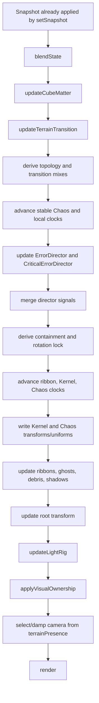

# CORE architecture

Status: updated after the 2026-08-30 stabilization pass. `ARCHITECTURE_AUDIT.md` remains the pre-refactor evidence baseline.

## Runtime boundary

`src/main.ts` creates `CoreStore`, `CodexActivityInterpreter`, and one `CoreVisual`. Store snapshots are mapped from product states to visual states by `getVisualState()` in `src/state.ts`, then synchronously passed to `CoreVisual.setSnapshot()`. The animation loop calls `CoreVisual.update(dt, time)` and renders one persistent Three.js scene.

The seven stable visual states are CALM, WORK, ERROR, CRITICAL, CRITICAL_2, CUBE, and TERRAIN. Product states `idle`, `success`, and `attention` all resolve to CALM.

## Major systems and current ownership

| Concern | Current implementation | Actual authority |
|---|---|---|
| Product state | `CoreStore` | `CoreStore` |
| Product-to-visual resolution | `getVisualState()` | Pure mapping |
| Activity automation | `CodexActivityInterpreter` | Dispatches product events until manual input disables it |
| Stable visual tuning | `STATE_TUNING` | Read by `CoreVisual`; also leaks into transitions because destination `state` may be installed early |
| Transition envelope | `TransitionController` | Owns requested/committed state, active primitive description, retarget destination, handoffs, and Cube progress command |
| Cube choreography | `CoreVisual.updateCubeMatter()` plus pure functions in `transition-primitives.ts` | Cube updater owns Cube phase/progress; controller owns cross-topology commands |
| Terrain choreography | `CoreVisual.updateTerrainTransition()` plus pure functions in `transition-primitives.ts` | Terrain updater owns Terrain phase/progress and publishes typed handoffs; it does not write Cube or directors |
| ERROR choreography | `ErrorDirector` | Local phase owner, but recovery continues after ERROR loses final-state ownership |
| CRITICAL choreography | `CriticalErrorDirector` | Local stage owner, but recovery continues after CRITICAL loses final-state ownership |
| Entity ownership | `resolveVisualOwnership()` and `applyVisualOwnership()` | Authoritative lifecycle/visibility snapshot for every renderer/helper |
| Camera | `updateCameraRig(ownership)` | Reads the ownership snapshot; cannot mutate transitions |
| Lights | `updateLightRig(ownership)` plus ownership application | Intensity and lifecycle visibility have separate owners |
| Shader appearance | `CoreVisual.update()` and entity update functions | Centralized writes, but several uniforms carry multiple meanings |

## Actual frame execution order



Typed handoffs are applied after the topology updaters, then the controller publishes one transition description and one ownership snapshot is calculated. Terrain no longer changes Cube fields, stable state, or directors directly. Appearance alpha remains independent from lifecycle visibility by design, but only `applyVisualOwnership()` writes runtime renderer visibility.

## State and transition model as implemented

There is now one controller envelope containing requested state, committed state, one active primitive description, and at most one typed handoff. The existing visual curves still use:

- `state`, the currently rendered final-state tuning target;
- a Cube phase enum and progress/direction flags;
- a Terrain phase enum, source/destination, elapsed/progress, and handoff flags;
- ERROR and CRITICAL director phases, including recovery tails;
- damped presence values that are sometimes treated as ownership;
- booleans for topology locking, special handoffs, and retarget cases.

Cube and Terrain phase/progress remain local workers during the incremental migration. Rapid input uses the controller's latest requested destination; Terrain return and reversible Cube motion retain their named interruption rules. Development invariants report conflicting full matter owners.

## Directors

`ErrorDirector` owns distortion, tear, collapse, eject, and containment choreography. Deactivation begins a 1.8-second recovery rather than immediately clearing its output.

`CriticalErrorDirector` owns early, mid, severe, containment, and recovery stages plus damage preview and ribbon rates. Deactivation begins a 2.2-second recovery.

Both directors run every frame. `CoreVisual` merges their scalar signals, mostly with `max()`, into shared `errorSignals`. Consequently, a director that no longer owns the stable state can still deform or illuminate geometry during another transition unless every consumer masks it.

## Persistent animation clocks

| Clock | Current owner | Consumers / coupling |
|---|---|---|
| RAF `time` | `main.ts` | Shared shader time, Cube cells, Terrain |
| `organismWavePhase` | `CoreVisual` | Kernel/ribbon organism wave |
| `coreGradientPhase` | `CoreVisual` | Kernel gradient |
| `coreDigitPhase` | `CoreVisual` | Kernel glyph phase |
| `coreRotation` | `CoreVisual` | Kernel orientation; stopped by generic topology lock |
| ribbon `orbitAngle` | Each ribbon record | Ribbon orbital orientation; stopped by generic lock except two Cube phases |
| ribbon `selfPhase` | Each ribbon record | Ribbon self rotation; same lock coupling |
| ribbon gradient/digit phases | Each ribbon record | Ribbon shaders; continue while hidden |
| `coreChaosTime` | `CoreVisual` | Internal Chaos binary particles |
| two `chaosLayerTimes` | `CoreVisual` | Outer/inner Chaos deformation; speed depends on stable state and Cube/Terrain compression logic |
| Error elapsed/jerk clocks | `ErrorDirector` | ERROR sequence and recovery |
| Critical stage/event clocks | `CriticalErrorDirector` | CRITICAL sequence and recovery |
| Cube normalized phase progress | Cube FSM fields | Cube lifecycle and several non-Cube effects |
| Terrain phase elapsed/progress | Terrain FSM fields | Terrain lifecycle, source consumption, Chaos handoff |
| activity timers | `CodexActivityInterpreter` | Automated product state sequence |

Persistent systems do not yet own explicit clock-enable policies. The ambiguous `topologyRotationLocked` crosses Kernel and ribbon clock domains, while Chaos clock rates depend on transition state outside the Chaos entity.

## Entity systems

All geometry is allocated once by `CoreVisual` and generally remains attached to the scene. Entity construction, update, visibility, and lifecycle are still concentrated in `src/visual.ts`. The complete registry and ownership matrix are in `VISUAL_OWNERSHIP.md`.

## Camera

There is one perspective camera. Its position/target are damped between the core family and Terrain family using `terrainPresence`. No transition object owns camera motion, so interrupted Terrain presence implicitly becomes the camera transition state.

## Lighting

Persistent scene lighting includes ambient, hemisphere fill, a directional key, four point lights around the root, and Cube-specific amber/violet lights. `updateLightRig()` calculates state/error/containment-dependent intensities and some visibility. `applyVisualOwnership()` subsequently gates selected Cube lights. Chaos emission is shader/material output, not a scene-light lifecycle.

## Shaders

The Kernel and ribbons share one vertex/fragment pair, selected by `uMobius`. That shader also contains ERROR damage, relief, absorption, and a dormant Terrain morph path. Chaos shells share containment shaders across stable Chaos, ERROR containment, Cube compression, and Terrain warm handoffs. Internal Chaos particles similarly serve stable Chaos and containment/reservoir roles. Terrain and Cube have dedicated shaders.

Shared shader inputs are appearance controls, not authoritative ownership. Dormant `uTerrainMorph` paths and the permanently invisible Cube helper were removed.

## Configuration boundaries

`STATE_TUNING` contains final-state appearance only. `TRANSITION_TUNING` contains topology durations and the default debug time scale. Renderer/artistic experiments remain under `CONFIG.EXPERIMENTS`. Named lifecycle thresholds live in `transition-primitives.ts`.

## Desired dependency direction

The implemented dependency direction is deliberately small:

```text
requested stable state
  -> transition controller (single active transition record)
  -> ownership snapshot + entity inputs
  -> entity updates / materials
  -> light and camera inputs
  -> render
```

Directors supply local choreography signals and expose lifecycle status. Recovery is represented by `settle-core-state` in the active transition snapshot. Detailed contracts are in `TRANSITION_CONTRACTS.md`.
