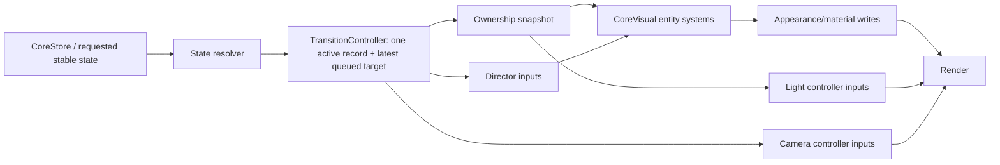

# Architecture audit report

Audit baseline: commit `6b0fcfb` on `main`. The worktree was clean before documentation was added. Inspected files: `src/visual.ts`, `src/shaders.ts`, `src/config.ts`, `src/state.ts`, `src/main.ts`, `src/activity.ts`, `src/error-director.ts`, `src/critical-error-director.ts`, `index.html`, `src/controls.css`, `package.json`, `vite.config.ts`, README, and relevant Git history/blame (`e5c9ecc`, `4999a8d`, `b8de0b9`, `c21840d`, `6b0fcfb`). No runtime behavior was changed during the audit itself. The approved stabilization implementation is described in `ARCHITECTURE.md`; findings below intentionally preserve the pre-refactor evidence.

## 1. Complete final-state graph

Seven final visual states exist:

| Key | Final state | Stable topology | Product-state mapping |
|---|---|---|---|
| 1 | CALM | CORE ribbons + Chaos | `idle`, `success`, `attention` |
| 2 | WORK | CORE ribbons + Chaos | `working` |
| 3 | ERROR | CORE under ErrorDirector | `error` |
| 4 | CRITICAL | CORE under containment-ending CriticalDirector | `critical` |
| 5 | CRITICAL_2 | CORE under non-ending CriticalDirector | `critical2` |
| 6 | CUBE | Cube cells/glyphs/lights | `cube` |
| 7 | TERRAIN | Terrain point field | `terrain` |

Modes 1–5 form one topology family but have different stable tuning/director contracts. CUBE and TERRAIN are independent topologies. Full per-state required/forbidden entities, clocks, camera, and entry/exit operations are in `STATE_GRAPH.md`.

## 2. Complete transition graph

The input surface accepts every requested state from every current state. Identity requests are stable no-ops or retarget signals. The 42 directed non-identity pairs reduce to:

- 20 CORE→CORE pairs among modes 1–5;
- 5 CORE→CUBE and 5 CUBE→CORE pairs;
- 5 CORE→TERRAIN and 5 TERRAIN→CORE pairs;
- CUBE→TERRAIN and TERRAIN→CUBE.

Current implementation families:

| Family | Current phases/mechanism |
|---|---|
| CORE→CORE | state tuning blend plus director activation/deactivation/recovery |
| CORE→CUBE | `convergeToError → kernelHold → morphToSeed → seedOnly → expand → idle` |
| CUBE→CORE | `collapseCube → reverseSeedOnly → seedToKernel → reverseKernelHold → releaseRibbons → inactive` |
| CORE→TERRAIN | `convergeSource → sourceHold → releasePoints → propagate → idle` |
| CUBE→TERRAIN | Cube collapse/reverse observed by Terrain, then Terrain release/propagation |
| TERRAIN→CORE | `collapsePoints → coreToChaos → releaseTarget` |
| TERRAIN→CUBE | Terrain collapse/warm Chaos, then direct mutation into Cube seed-morph/expansion phases |

The compositional target and every dependent pair are in `TRANSITION_CONTRACTS.md`.

## 3. All visual entities

Persistent scene entities are:

1. renderer, scene, root group, and camera;
2. Kernel sphere;
3. Chaos outer shell;
4. Chaos inner shell;
5. 640-point internal Chaos binary/Disco Ball reservoir;
6. three ribbon glyph surfaces;
7. three ribbon dark shadow surfaces;
8. six ribbon ghost surfaces;
9. per-ribbon ERROR ejection/debris/damage particle systems;
10. 512-cell Cube instanced mesh;
11. Cube seed mesh;
12. 2,048-point Cube glyph field;
13. Cube amber light;
14. Cube violet light;
15. permanently transparent Cube core helper;
16. 43,200-point Terrain field;
17. Terrain transition front encoded within the Terrain shader, not separate geometry;
18. ambient light, hemisphere fill, directional key, and four root point lights;
19. DOM HUD/control panels outside topology ownership.

There is no remaining dense Terrain point-core renderer. Creation, update, visibility, scale, opacity, clocks, shaders, stable states, transitions, deactivation, and persistence for every item are documented in `VISUAL_OWNERSHIP.md`.

## 4. All directors

- `CodexActivityInterpreter`: product/activity director. It dispatches idle/arming/working/success events based on CPU activity until manual keyboard control disables it.
- `ErrorDirector`: ERROR choreography with distortion, tear, collapse, eject, containment, and a 1.8-second recovery tail.
- `CriticalErrorDirector`: CRITICAL/CRITICAL_2 choreography with early/mid/severe/containment/recovery stages, damage preview, event clock, and a 2.2-second recovery tail.
- `CoreVisual` currently acts as an undeclared global transition director for both Cube and Terrain in addition to rendering entities.

No independent camera, light, ownership, or transition director exists.

## 5. All persistent animation clocks

- shared RAF time;
- `organismWavePhase`, `coreGradientPhase`, `coreDigitPhase`, and `coreRotation`;
- per-ribbon `orbitAngle`, `selfPhase`, `gradientPhase`, and `digitPhase`;
- `coreChaosTime` and two `chaosLayerTimes`;
- ErrorDirector elapsed and jerk clocks;
- CriticalErrorDirector stage and event clocks;
- Cube phase/progress/formation time;
- Terrain phase elapsed/progress and global shader time;
- activity interpreter wall-clock timers.

The clock ownership/coupling table is in `ARCHITECTURE.md`. Persistent entity clock policies are currently implicit.

## 6. Global/shared mutable transition values

Important shared values are:

- `state` and the blended stable tuning values;
- `cubePhase`, `cubeTransition`, `cubeReverseActive`, Cube presence/formation/compression, and `cubeTerrainHandoff`;
- `terrainPhase`, `terrainPhaseElapsed`, `terrainTransition`, `terrainEntrySource`, `terrainDestination`, `terrainPresence`, `terrainConvergence`, `terrainSourceConsumption`, `terrainChaosPaletteProgress`, `terrainChaosStartScale`, and Terrain/Cube handoff flags;
- `chaosFillProgress`, `chaosVisualPresence`, and `stableChaosPresence`;
- merged `errorSignals`, containment values, `containmentLatched`, and `topologyRotationLocked`;
- ribbon and Kernel orientations/phases;
- entity group visibility, material opacity/emission, shader visibility/intensity/fill;
- camera position/target damping state and light intensity/visibility.

These values are read across state resolution, two FSMs, directors, entity updates, ownership, lights, and camera.

## 7. Values with more than one writer

| Value/concept | Writers | Consequence |
|---|---|---|
| `state` | `setSnapshot()`, `updateTerrainTransition()` | Mid-frame state changes and early destination tuning |
| Cube phase/progress/direction | `setSnapshot()`, `updateCubeMatter()`, `updateTerrainTransition()` | Terrain can reset or start Cube behavior |
| Terrain phase/progress/source/destination | `setSnapshot()`, `updateTerrainTransition()` | Retarget can partially overwrite active lifecycle |
| Director requested/recovery state | `setSnapshot()`, Terrain handoff branch, director internal recovery | A previous director may still output after transition ownership changes |
| Effective containment | ErrorDirector, CriticalErrorDirector, Cube/Terrain-derived topology values, merge logic | One scalar carries fault and topology lifecycle meanings |
| Effective entity visibility | ownership, updater-specific `.visible`, opacity, emission, shader alpha, scale | No single answer per renderer |
| Cube violet visibility | `updateLightRig()`, `applyVisualOwnership()` | Last writer wins |
| Camera transition state | Terrain updater writes presence; camera tail consumes/damps it | Camera lifecycle is hidden inside entity presence |

Scalar shader uniforms generally have one TypeScript assignment site per frame, but their effective value is composed from several independent owners, so the conceptual property still has multiple writers.

## 8. Entities with more than one visibility authority

Kernel, both Chaos shells, Chaos binary points, ribbon glyphs, ribbon shadows, ribbon ghosts, fault particles, Cube cells, Cube seed, Cube glyphs, Cube violet light, and Terrain points all have multiple visibility/lifecycle authorities. Exact authorities and risks are tabulated in `VISUAL_OWNERSHIP.md`.

The most important finding is that `getVisualOwnership()` is not authoritative: it primarily models Cube phases, does not model Terrain or several child/helper entities, and is followed or preceded by independent updater/shader gates.

## 9. Duplicated transition implementations

- CORE absorption exists separately in Cube `convergeToError`/`kernelHold` and Terrain `convergeSource`/`sourceHold`.
- CORE release exists separately in Cube `reverseKernelHold`/`releaseRibbons` and Terrain `releaseTarget`.
- Compact Chaos sizing, fill, palette, and source consumption are recomputed in several Cube/Terrain phase branches.
- Director activation/deactivation occurs both on snapshot receipt and at delayed Terrain handoff.
- Cube/Terrain reverse behavior duplicates partial inverse calculations rather than composing reversible primitives.

These are similar responsibilities rather than byte-for-byte copies, which is precisely why fixes drift between transition families.

## 10. State-specific cases inside generic transition/render code

- `terrainExitBlocksCube` inside `updateCubeMatter()`.
- Terrain-source reverse floors and `cubeTerrainHandoff` inside Cube progression.
- `ribbonTopologyMotionAllowed` recognizes two Cube phases inside the generic ribbon clock/transform update.
- Terrain/Cube phase and destination checks inside Chaos scale, fill, warmth, and visibility calculations.
- `terrainExclusive` and `terrainCubeSeed` overrides around generic ownership.
- Terrain gates inside fault-particle and Kernel/ribbon visibility.
- stable state names used directly to select containment and director behavior inside the monolithic update.

The visible requirements behind some cases are valid; their location/ownership is the architecture defect.

## 11. Transition-specific cases inside final-state code

- `STATE_TUNING` is blended while a transition may still own the scene because `state` can be changed before handoff.
- `stableChaosPresence` depends on Cube matter/phase and Terrain conditions rather than only stable CORE ownership.
- Chaos clock rates and Kernel visibility depend on Cube/Terrain transition state.
- final ERROR/CRITICAL directors may be started by Terrain transition completion, not by a stable-state commit boundary.
- Cube final-state light/material updates contain formation/collapse lifecycle gates.

Final-state appearance and transition lifecycle are therefore not isolated.

## 12. Hidden update-order dependencies

1. `blendState()` executes before Terrain may change `state`; reordering changes a visible frame.
2. Cube updates before Terrain; Terrain relies on observing Cube progress and can reset it afterward.
3. Directors update after Terrain can activate/deactivate them; moving this call changes handoff timing.
4. Merged error signals are calculated before transforms/uniforms and act as global deformation inputs.
5. shader visibility values are computed independently before final group ownership gates.
6. `updateLightRig()` precedes `applyVisualOwnership()`; Cube violet visibility depends on last-writer order.
7. camera selection occurs after entity/ownership updates and follows damped `terrainPresence`.
8. `setSnapshot()` mutates phase fields synchronously between animation frames, so input arrival timing changes the next update path.

## 13. Lifecycle represented through opacity/emission

- Kernel uses group visibility plus shader `uVisibility`/intensity/alpha.
- Chaos shells use group visibility, scale, `uIntensity`, `uFillProgress`, and fragment alpha.
- Chaos binary/debris particles use `.visible`, intensity/fill, and shader alpha/emission.
- ribbons use group visibility, absorption, `uVisibility`, and fragment alpha.
- ribbon shadows use `.visible` plus material opacity.
- Cube cells/seed/glyphs use visibility plus formation and opacity/uniform visibility.
- Terrain uses group visibility plus `uPresence` and per-point alpha.
- Cube lights use both visibility and zero intensity.

These appearance controls are useful for morphs, but currently also substitute for entity deactivation.

## 14. Suspicious shared shader uniforms

| Uniform | Why suspicious |
|---|---|
| `uTerrainMorph` | Present in shared Kernel/ribbon, Chaos shell, and binary particle shaders; all runtime writers set zero |
| `uIntensity` | Mixes artistic energy/deformation with effective visibility/lifecycle across several shader systems |
| `uVisibility` | Acts as lifecycle for Kernel/ribbons/Cube glyphs despite separate object ownership |
| `uCompression` | Used for fault containment and topology compaction semantics |
| `uSeedMorph` | Pulls stable Chaos renderers into Cube transition responsibility |
| `uFillProgress` | Mixes matter fill and effective alpha/lifecycle |
| `uTransitionWarm` / `uTerrainWarm` | Terrain palette language is embedded in shared particle/containment renderers |
| `uMobius` | Selects two entity roles inside one broad shader that also contains multiple transition effects |

`uTerrainMorph` is proven dormant; others require semantic extraction before deciding whether to split shaders.

## 15. Cross-system animation locks

`topologyRotationLocked` is the main cross-system lock. It controls Kernel core rotation and ribbon orbit/self phases even though those clocks have separate visual responsibilities. `ribbonTopologyMotionAllowed` bypasses the lock for Cube absorption/release to restore natural ribbon rotation. Chaos clock rate is also indirectly locked/slowed by Cube/Terrain compression/state logic. No explicit camera/clock lock types exist.

## 16. Circular dependencies

| Cycle | Evidence | Required break |
|---|---|---|
| Cube phase → Terrain logic → Cube phase | Terrain observes and writes Cube progress/phase | Controller composes primitives through handoff snapshots/events |
| transition → visibility → presence → transition appearance | Presence values are both visual damping and lifecycle inputs | Ownership progress is canonical; presence is derived appearance |
| director containment → topology fields → visibility/rotation lock → director-visible geometry | Merged signals drive shared topology while recovery persists | Directors output local appearance only under explicit ownership |
| stable state → transition tuning → direct state commit → stable state | Destination `state` changes while transition is active | Separate requested, committed stable, and active transition state |
| Terrain presence → camera → visual perception of Terrain lifecycle | Camera target uses entity presence as its transition owner | Camera consumes explicit transition camera blend |

These are conceptual cycles even where there is no direct function recursion.

## 17. Obsolete/dead branches

Proven by repository-wide read/write search:

- all `uTerrainMorph` shader branches are dormant because every runtime write is zero;
- Cube `core` helper is permanently transparent;
- Cube `formedMass` is calculated and stored but never read;
- debug flags `microGlow`, `mesoGlow`, and `macroGlow` are declared/defaulted but never consumed;
- `StateTuning.openness` is configured but never read.

Obsolete/misnamed but still executed:

- Terrain phase `coreToChaos` and duration `terrainCoreMorphSeconds` now perform palette/compact handoff after the dense point core was removed;
- shader comments and README retain older Terrain/reservoir descriptions.

No additional phase enum was proven unreachable. ERROR/CRITICAL recovery behavior is classified uncertain and must be captured before removal.

## 18. Architecture hacks, with evidence

Using the task's definition, the following are hacks:

- `terrainExitBlocksCube`: one transition repairs another updater's behavior.
- Terrain writes Cube state and `cubeTerrainHandoff`: two systems manually synchronize lifecycle.
- `ribbonTopologyMotionAllowed`: a state/phase exception repairs an over-broad lock.
- `wasContainedDestinationRelease`, `alreadyContained`, `alreadyPrepared`: history flags manually reconstruct a missing primitive input contract.
- `terrainExclusive`/`terrainCubeSeed`: visibility overrides repair incomplete ownership.
- direct director activation inside Terrain: transition code modifies unrelated final-state choreography.
- opacity/emission/scale cleanup stacks: lifecycle is represented by appearance.
- hard Terrain return remap around `.68`: one source/destination interruption is encoded because no general retarget policy exists.
- long phase/source/destination chains for compact Chaos scale/palette: a renderer infers which transition owns it.

Git evidence: Cube/Terrain machinery arrived together in `b8de0b9`; the canonical Terrain rebuild and cross-topology conditions expanded in `c21840d`; `6b0fcfb` added several ownership, handoff, and rotation-continuity repairs after visible regressions. These commits show the special cases accumulated at integration boundaries rather than in isolated primitives. Necessary domain rules and uncertain behavior are separately classified in `TECH_DEBT.md`.

## 19. Proposed target architecture

Keep the application small; no framework or ECS is needed.

Required invariants:

- requested state, committed stable state, and active transition are different fields;
- one active primitive owns each progress value;
- only the controller changes phase and stable-state commit;
- ownership emits `inactive/transitional/active`, matter weight, visibility, and clock policy for every entity;
- entity systems receive read-only inputs and cannot start another topology/director;
- directors cannot steal ownership; recovery is an explicit transition segment;
- per-entity clocks preserve phase independently of unrelated locks;
- camera and light values derive from explicit stable/transition snapshots;
- one latest queued destination or an explicitly reversible retarget is allowed; arbitrary flag overlap is not.

Suggested local modules: `transition-controller.ts` and `visual-ownership.ts`; keep entity rendering in `visual.ts` initially to avoid over-fragmentation.

## 20. Proposed phased migration plan

### Phase A — behavior baseline and diagnostics (no visual change)

Add a development snapshot and assertions for stable-state ownership, one active topology transition, no completed director tail, and mutually exclusive full owners. Add a scripted/semi-automated 7×7 transition matrix protocol and capture accepted stable-state screenshots/metrics.

### Phase B — explicit state/transition record (pure refactor)

Introduce `requestedState`, `stableState`, and one `ActiveTransition`. Adapt current Cube/Terrain phases behind the controller without changing timing curves. Implement latest-destination queuing and preserve only the currently accepted Terrain-return behavior as a named interruption rule.

### Phase C — authoritative ownership (pure refactor)

Create first-class keys for every renderer/helper. Calculate lifecycle, matter weights, visibility, and animation policy once. Make updater code consume ownership; remove duplicate `.visible` writers while retaining identical opacity/emission curves.

### Phase D — clocks, locks, directors, camera, and lights (pure refactor)

Give entities explicit clock policies; replace the generic topology lock with narrowly named orientation/phase inputs. Move recovery under transition ownership. Resolve camera and light snapshots before entity update; eliminate last-writer order dependencies.

### Phase E — reusable transition primitives (pure refactor)

Extract the eight contracts in `TRANSITION_CONTRACTS.md` from existing curves. Give each one progress `0…1`, input/output ownership contracts, completion event, and interruption rule. Remove direct Terrain→Cube/state/director writes.

### Phase F — lifecycle and dead-code cleanup (pure refactor)

After behavior comparison, remove dormant `uTerrainMorph`, Cube hidden core/`formedMass`, unused debug/tuning fields, stale comments/names, and appearance-as-cleanup gates made redundant by ownership. Separate final-state and transition config.

### Phase G — full regression and hardening

Run every supported directed pair at normal and 0.25× speed, return transitions, safe-point retargets, and rapid sequences. Promote invariant violations to development failures and retain the hidden inspector.

### Phase V — requested visual transition refinement (separate behavior change)

Only after architectural review/migration checkpoints, verify and finish the previously requested ribbon rotation continuity, 6→2 orientation continuity, removal of stray spheres, monotonic Chaos shrink into Terrain, and real warm two-shell Chaos on Terrain exit. This phase must not be mixed into a refactor commit.

## 21. Regression risk for every phase

| Phase | Risk | Main regressions | Gate before continuing |
|---|---|---|---|
| A | Low | Debug code accidentally visible or affects timing | Production UI unchanged; build; snapshot disabled by default |
| B | High | Retarget semantics, one-frame state timing, Cube/Terrain phase discontinuity | All seven stable states plus 2→7→3→6 and every 6/7 family path match baseline |
| C | High | Ghost helpers, brief flashes, missing shadows/lights, shader alpha mismatch | Ownership inspector plus frame-by-frame entry/exit checks for all topology families |
| D | High | Ribbon orientation jumps, frozen Chaos, altered ERROR/CRITICAL recovery, camera/light pop | Clock continuity logs and visual comparisons of 1–5, 1–5↔6, 1–5↔7, 6↔7 |
| E | Very high | Curve/timing drift across all composed routes | Test every dependent pair per primitive; no phase proceeds on failed comparison |
| F | Medium | Dormant-looking shader/helper was indirectly visible on edge path | Search proof, shader compile, full matrix at normal and slow speed |
| G | Low runtime / medium tooling | Flaky timing assertions or incomplete coverage | Deterministic tolerances; manual review of failures |
| V | Medium and intentional | Accepted visuals change outside requested transition family | Separate diff/commit and explicit family regression review |

## 22. Exact proposed file list per phase

No file list below authorizes implementation before review.

| Phase | Files to create | Files to modify |
|---|---|---|
| A | `src/transition-debug.ts`, `scripts/transition-matrix.mjs`, `docs/BEHAVIOR_BASELINE.md` | `src/visual.ts`, `src/main.ts`, `package.json`, `docs/ARCHITECTURE.md`, `docs/STATE_GRAPH.md` |
| B | `src/transition-controller.ts` | `src/visual.ts`, `src/state.ts`, `src/main.ts`, `src/config.ts`, `docs/ARCHITECTURE.md`, `docs/STATE_GRAPH.md`, `docs/TRANSITION_CONTRACTS.md`, `docs/TECH_DEBT.md` |
| C | `src/visual-ownership.ts` | `src/visual.ts`, `docs/VISUAL_OWNERSHIP.md`, `docs/ARCHITECTURE.md`, `docs/TECH_DEBT.md` |
| D | none planned | `src/visual.ts`, `src/error-director.ts`, `src/critical-error-director.ts`, `src/transition-controller.ts`, `src/visual-ownership.ts`, `src/config.ts`, `docs/ARCHITECTURE.md`, `docs/TRANSITION_CONTRACTS.md`, `docs/VISUAL_OWNERSHIP.md`, `docs/TECH_DEBT.md` |
| E | `src/transition-primitives.ts` | `src/transition-controller.ts`, `src/visual.ts`, `src/config.ts`, `src/transition-debug.ts`, `scripts/transition-matrix.mjs`, `docs/ARCHITECTURE.md`, `docs/STATE_GRAPH.md`, `docs/TRANSITION_CONTRACTS.md`, `docs/VISUAL_OWNERSHIP.md`, `docs/TECH_DEBT.md` |
| F | none planned | `src/visual.ts`, `src/shaders.ts`, `src/config.ts`, `README.md`, `zavisimosti.md`, `docs/ARCHITECTURE.md`, `docs/VISUAL_OWNERSHIP.md`, `docs/TECH_DEBT.md` |
| G | none planned | `scripts/transition-matrix.mjs`, `src/transition-debug.ts`, `package.json`, `docs/BEHAVIOR_BASELINE.md`, `docs/STATE_GRAPH.md`, `docs/TRANSITION_CONTRACTS.md`, `docs/TECH_DEBT.md` |
| V | none expected | `src/visual.ts`, possibly `src/shaders.ts` and `src/config.ts`, plus `zavisimosti.md`; architecture docs only if a contract genuinely changes |

Before each phase, re-check the worktree and reduce the file list if the preceding phase makes a planned file unnecessary. Expanding it requires a new blast-radius report before editing.
