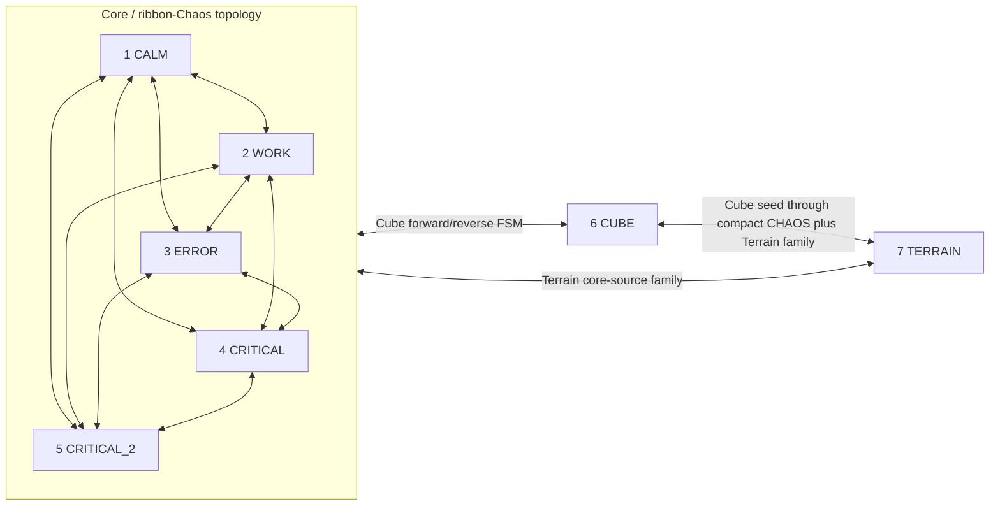

# Stable-state and transition graph

Status: accepted behavior snapshot before architecture refactoring. Numbers match manual keyboard modes.

## Final-state graph

All 49 requested origin/destination combinations are nominally accepted by keyboard input, including identity requests. The diagram groups the 20 directed transitions among modes 1–5 because they do not change topology. The 10 directed core/Cube, 10 directed core/Terrain, and 2 directed Cube/Terrain paths are implemented by shared but currently entangled phase logic. Identity requests are stable no-ops except when used to retarget an unfinished transition.

## Stable-state invariant

A stable state must be reproducible without knowledge of its previous state. Cube is stable with `cubePhase === 'idle'`; Terrain is stable with `terrainPhase === 'idle'`; modes 1–5 should have no Cube/Terrain phase and no previous director recovery. The current runtime does not enforce the last condition, so the contracts below are design requirements and regression targets rather than guaranteed invariants.

## 1 — CALM

- Active topology: ribbon plus two-shell Chaos.
- Required entities: three ribbon glyph surfaces and shadows, Chaos outer/inner shells, ambient/core lighting. Kernel may remain allocated but has no stable visual ownership.
- Forbidden entities: Cube cells/seed/glyphs/lights; Terrain points; ERROR debris and damage particles after settling.
- Clocks: ribbon orbit/self/gradient/digit and independent Chaos shell/particle clocks at calm rates.
- Directors: neither active nor recovering after settlement.
- Camera: core camera family.
- Entry primitives: same-topology settle; Cube reverse/release; Terrain inward front to compact Chaos then target release.
- Exit primitives: same-topology choreography; compact-to-Cube; compact-Chaos-to-Terrain.

## 2 — WORK

- Active topology: ribbon plus two-shell Chaos, with WORK energy/relief and faster Chaos life.
- Required entities: the same persistent topology as CALM with WORK appearance and clock rates.
- Forbidden entities: Cube, Terrain, settled ERROR debris/damage.
- Clocks: ribbon and Chaos clocks enabled; WORK does not depend on a prior transition lock.
- Directors: neither active nor recovering after settlement.
- Camera: core camera family.
- Entry/exit primitives: same families as CALM.

## 3 — ERROR

- Active topology: ribbon/Kernel/Chaos matter choreographed by `ErrorDirector`.
- Required entities: ribbons, transitionally visible Kernel/Chaos shells, ERROR debris/ejection matter as selected by ERROR phase.
- Forbidden entities: Cube and Terrain stable renderers.
- Clocks: ribbon, Kernel, Chaos, and ErrorDirector clocks according to the ERROR contract; no Cube/Terrain clock owns matter.
- Directors: `ErrorDirector` exclusively active; `CriticalErrorDirector` inactive after handoff.
- Camera: core camera family.
- Entry primitive: same-topology director activation or target release from Cube/Terrain, then ERROR choreography.
- Exit primitive: explicit ERROR recovery must belong to the chosen outgoing transition rather than running in the background.

## 4 — CRITICAL

- Active topology: ribbon/Kernel/Chaos matter under the containment-ending Critical choreography.
- Required entities: ribbons, Chaos/Kernel and damage/ghost systems selected by the current critical stage.
- Forbidden entities: Cube and Terrain stable renderers.
- Clocks: topology clocks plus CriticalDirector stage/event clocks.
- Directors: `CriticalErrorDirector` exclusively active with containment ending enabled.
- Camera: core camera family.
- Entry primitive: same-topology activation or target release, then CRITICAL choreography.
- Exit primitive: explicit critical recovery/handoff owned by the outgoing transition.

## 5 — CRITICAL_2

- Active topology: ribbon/Kernel/Chaos matter under the non-containment-ending Critical choreography.
- Required/forbidden entities: same topology boundary as CRITICAL, with its own state tuning and director mode.
- Clocks: topology clocks plus CriticalDirector stage/event clocks.
- Directors: `CriticalErrorDirector` exclusively active with containment ending disabled.
- Camera: core camera family.
- Entry/exit primitives: the same topology families as CRITICAL; its different choreography is a director parameter, not a new topology transition.

## 6 — CUBE

- Active topology: complete Cube cells and Cube glyph matter.
- Required entities: Cube cells, Cube glyphs, appropriate Cube lights.
- Forbidden entities: ribbons, ribbon shadows/ghosts, Kernel, Chaos shells/binary particles, Terrain points, ERROR debris/damage.
- Clocks: Cube time/rotation and cell/glyph shader time only; hidden core topology clocks may continue only if explicitly chosen, never because they still own matter.
- Directors: inactive and not recovering.
- Camera: core/Cube camera family.
- Entry primitives: source topology to compact Chaos, compact source to seed, seed expansion.
- Exit primitives: Cube collapse to seed, seed to compact source, then release target; to Terrain, the seed is the compact handoff source.

## 7 — TERRAIN

- Active topology: canonical 43,200-point Terrain field.
- Required entities: Terrain points only, plus persistent scene lights appropriate to Terrain.
- Forbidden entities: ribbon topology and helpers, Kernel, Chaos shells/binary matter, Cube cells/seed/glyphs/lights, ERROR debris/damage.
- Clocks: Terrain shader/wave clock. Ribbon, Chaos, and director clocks must not influence Terrain ownership.
- Directors: inactive and not recovering.
- Camera: Terrain camera family.
- Entry primitives: converge source to compact handoff, hold, release Terrain points/front, propagate.
- Exit primitives: collapse Terrain points/front into compact warm Chaos; then release a mode 1–5 target or form Cube seed.

## Current interruption behavior

`TransitionController` retains the latest requested destination while one active transition envelope owns the current handoff. Current interruption handling includes:

- returning to Terrain during a Terrain exit, remapped to a late `releasePoints`/`propagate` progress;
- Cube forward/reverse direction changes based on `cubeReverseActive` and phase state;
- Terrain observing and resetting Cube phase/progress during Cube/Terrain handoffs;
- ERROR/CRITICAL recovery exposed as an explicit `settle-core-state` transition status.

The remaining validation requirement is a browser-driven rapid-input matrix, especially 2 → 7 → 3 → 6. Development snapshots expose requested/committed state, primitive, progress, owners, clocks, directors, and invariant violations.
